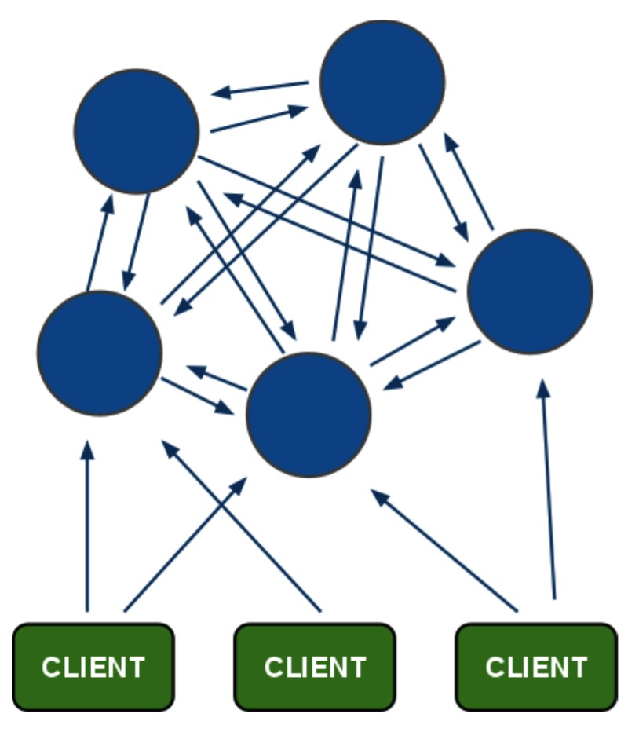
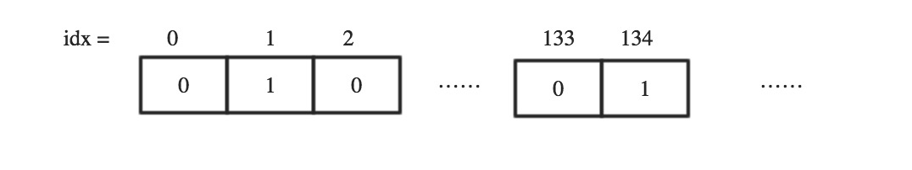
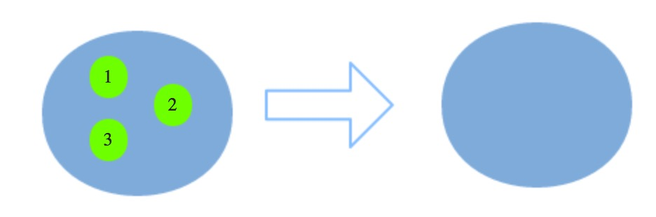
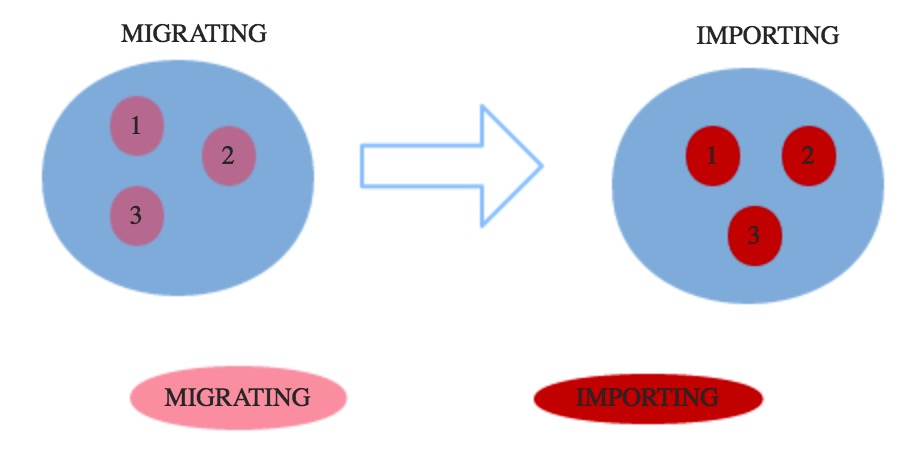
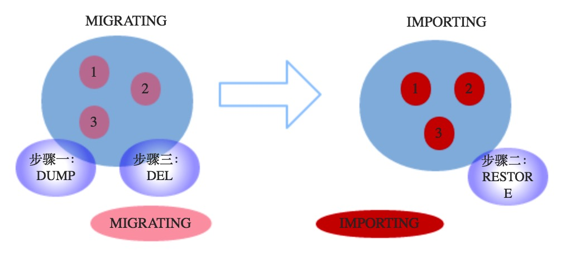

# img/Redis Cluster 分区实现原理

- 参考博客：http://blog.jobbole.com/103258/

---

## 认识Redis Cluster

- Redis Cluster具有分布式系统的特点，也具有分布式系统如何实现高可用性与数据一致性的难点，由多个Redis实例组成的Redis Cluster结构通常如下：



##### Redis Cluster特点

- 所有的节点相互连接；
- 集群消息通信通过集群总线通信，集群总线端口大小为客户端服务端口+10000，这个10000是固定值；
- 节点与节点之间通过二进制协议进行通信；
- 客户端和集群节点之间通信和通常一样，通过文本协议进行；
- 集群节点不会代理查询；

---

## Redis Cluster分区实现原理

### 槽（slot）概念

- Redis Cluster中有16384个槽的概念，他们的编号为0、1、2、3……16382、16383。这些槽是一个虚拟的槽，并不是真正存在的。
- 正常工作的时候，Redis Cluster中的每个Master节点都会负责一部分的槽，当有某个key被映射到某个Master负责的槽，那么这个Master负责为这个key提供服务，至于哪个Master节点负责哪个槽，这是可以由用户指定的，也可以在初始化的时候自动生成（redis-trib.rb脚本）。
- 这里值得一提的是，在Redis Cluster中，只有Master才拥有槽的所有权，如果是某个Master的slave，这个slave只负责槽的使用，但是没有所有权。
- Redis Cluster怎么知道哪些槽是由哪些节点负责的呢？某个Master又怎么知道某个槽自己是不是拥有呢？

### 位序列结构

- Master节点维护着一个16384/8字节的位序列，Master节点用bit来标识对于某个槽自己是否拥有。比如对于编号为1的槽，Master只要判断序列的第二位（索引从0开始）是不是为1即可。



- 如上面的序列，表示当前Master拥有编号为1，134的槽。集群同时还维护着槽到集群节点的映射，是由长度为16384类型为节点的数组实现的，槽编号为数组的下标，数组内容为集群节点，这样就可以很快地通过槽编号找到负责这个槽的节点。位序列这个结构很精巧，即不浪费存储空间，操作起来又很便捷。

### 键空间分布基本算法

- 这里讲的是Redis Cluster如何将键空间分布在不同的节点的，键空间意为Redis Cluster所拥有用户所有数据集合的键的取值范围，这个范围叫做键空间。
- 提到空间分布，必然会想到哈希算法，没错，通过哈希算法再加上取模运算可以将一个值固定地映射到某个区间，在这里，这个区间叫做slots，区间由连续的slot组成。
- 在Redis Cluster中，我们拥有16384个slot，这个数是固定的，我们存储在Redis Cluster中的所有的键都会被映射到这些slot中，下面讲讲Redis Cluster是如何做映射的。
- 键到slot的基本映射算法如下：

```c
HASH_SLOT = CRC16(key) mod 16384
```

- 经过简单的计算就得到了当前key应该是存储在哪个slot里面，指定的key会被存储在哪个slot，这个关系是铁打不变的。
- 如果我提交了一批命令，往Redis中存储一批键，那么这些键一般会被映射到不同的slot，而不同的slot又可能由Redis Cluster中不同的节点服务，这样就和的预期有点不同，有没有办法将这批键映射到同一个slot呢？答案是可以。

### 键哈希标签原理

- 键哈希标签是一种可以让用户指定将一批键都能够被存放在同一个槽中的实现方法，用户唯一要做的就是按照既定规则生成key即可，这个规则是这样的，如果我有对于同一个用户有两种不同含义的两份数据，我只要将他们的键设置为下面即可：

```c
abc{userId}def和ghi{userId}jkl
```

- redis在计算槽编号的时候只会获取{}之间的字符串进行槽编号计算，这样由于上面两个不同的键，{}里面的字符串是相同的，因此他们可以被计算出相同的槽，相关代码如下：

```c
unsigned int keyHashSlot(char *key, int keylen) {
    int s, e; 
    for (s = 0; s < keylen; s++)
        if (key[s] == '{') break;
 
    if (s == keylen) return crc16(key,keylen) & 0x3FFF;
 
    for (e = s+1; e < keylen; e++)
        if (key[e] == '}') break;
 
    if (e == keylen || e == s+1) return crc16(key,keylen) & 0x3FFF;
    return crc16(key+s+1,e-s-1) & 0x3FFF;
}
```

- 客户端是怎么在Redis Cluster中找到正确的节点的呢？下面看看。

### 重定向客户端

- 文章开始讲到，Redis Cluster并不会代理查询，那么如果客户端访问了一个key并不存在的节点，这个节点是怎么处理的呢？比如我想获取key为msg的值，msg计算出来的槽编号为254，当前节点正好不负责编号为254的槽，那么就会返回客户端下面信息：

```redis
GET msg
-MOVED 254 127.0.0.1:7000
```

- 表示客户端想要的254槽由运行在IP为127.0.0.1，端口为7000的Master实例服务。如果根据key计算得出的槽恰好由当前节点负责，则当期节点会立即返回结果。这里明确一下，没有代理的Redis Cluster可能会导致客户端两次连接急群中的节点才能找到正确的服务，推荐客户端缓存连接，这样最坏的情况是两次往返通信。

### 重新分片（Resharding）

- 重新分片意为槽到集群节点的映射关系要改变，不变的是键到槽的映射关系，因此当重新分片的时候，如果槽中有键，那么键也是要被移动到新的节点的。下面看看重新分片是怎么做的，假如我们有一批槽需要从一个Master节点移动到另一个Master节点：



- 这里简化模型，假设这批待迁移的槽编号为1、2、3，并假设左边的节点为MasterA节点，右边的节点为MasterB节点。

### 槽迁移的过程

- 槽迁移的过程中有一个不稳定状态，这个不稳定状态会有一些规则，这些规则定义客户端的行为，从而使得Redis Cluster不必宕机的情况下可以执行槽的迁移。下面这张图描述了我们迁移编号为1、2、3的槽的过程中，他们在MasterA节点和Master节点中的状态。



#### MIGRATING状态

- 本例中MIGRATING状态是发生在MasterA节点中的一种槽的状态，预备迁移槽的时候槽的状态首先会变为MIGRATING状态，这种状态的槽会实际产生什么影响呢?当客户端请求的某个Key所属的槽处于MIGRATING状态的时候，影响有下面几条：
  1. 如果Key存在则成功处理。
  2. 如果Key不存在，则返回客户端ASK，仅当这次请求会转向另一个节点，并不会刷新客户端中node的映射关系，也就是说下次该客户端请求该Key的时候，还会选择MasterA节点。
  3. 如果Key包含多个命令，如果都存在则成功处理，如果都不存在，则返回客户端ASK，如果一部分存在，则返回客户端TRYAGAIN，通知客户端稍后重试，这样当所有的Key都迁移完毕的时候客户端重试请求的时候回得到ASK，然后经过一次重定向就可以获取这批键。

##### IMPORTING状态

- 本例中的IMPORTING状态是发生在MasterB节点中的一种槽的状态，预备将槽从MasterA节点迁移到MasterB节点的时候，槽的状态会首先变为IMPORTING。IMPORTING状态的槽对客户端的行为有下面一些影响：
  1. 正常命令会被MOVED重定向，如果是ASKING命令则命令会被执行，从而Key没有在老的节点已经被迁移到新的节点的情况可以被顺利处理；
  2. 如果Key不存在则新建；
  3. 没有ASKING的请求和正常请求一样被MOVED，这保证客户端node映射关系出错的情况下不会发生写错；

##### 键空间迁移

- 键空间迁移是指当满足了槽迁移前提的情况下，我们就可以通过相关命令将槽1、2、3中的键空间从MasterA节点转移到MasterB节点，这个过程真正实现数据转移。相关命令：
- MIGRATE：
  1. DUMP
  2. RESTORE
  3. DEL
- MIGRATE命令通过三步将数据转移，示意图如下：



- 经过上面三步可以将键空间数据迁移，然后再将处于MIGRATING和IMPORTING状态的槽变为常态即可，完成整个重新分片的过程。然而MIGRATE并不是原子的，如果在MIGRATE出现错误的情况可能会导致下面问题：
  - 键空间在两个节点都存在；
  - 键空间只存在第一个节点；

